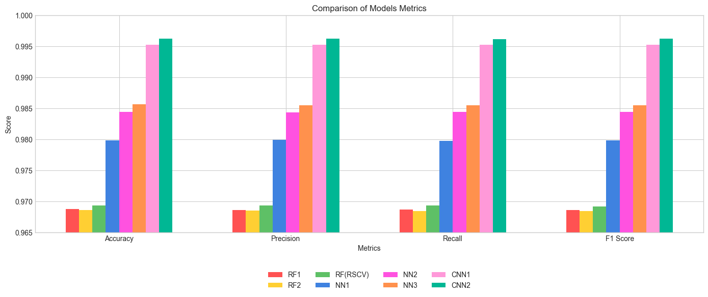
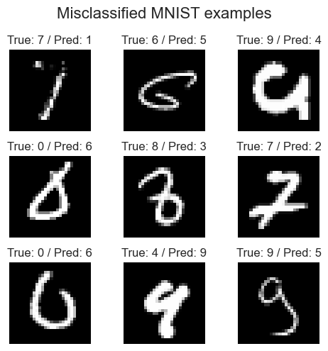

# MNIST Classification Task

A comprehensive implementation of three different machine learning algorithms for MNIST digit classification: Random Forest, Feed-Forward Neural Network, and Convolutional Neural Network.

## Table of content
- [Project Overview](#project-overview)
- [Installation and Setup](#installation-and-setup)
- [Project Structure](#project-structure)
- [Model Experimentation](#model-experimentation)
  - [Random Forest Classifier](#random-forest-classifier)
  - [Feed-Forward Neural Network](#feed-forward-neural-network)
  - [Convolutional Neural Network](#convolutional-neural-network)
- [Cross-Model Comparison](#cross-model-comparison)
- [Misclassified Examples](#misclassified-examples)
- [General Summary](#general-summary)

## Project Overview

This project implements three distinct classification approaches for the MNIST dataset:

1. Random Forest (RF) - A tree-based ensemble learning method
2. Feed-Forward Neural Network (NN) - A fully-connected deep learning model
3. Convolutional Neural Network (CNN) - A deep learning model specialized for image data

All models implement a common interface (`MnistClassifierInterface`) and are accessible through a unified `MnistClassifier` wrapper class, ensuring consistent API regardless of the chosen algorithm.

## Installation and Setup

### Prerequisites

- Python 3.9 or higher (developed and tested on Python 3.12)
- pip package manager

### Step 1: Clone the Repository

```bash
git clone <repository-url>
```

### Step 2: Create Virtual Environment (Recommended)

```bash
# On Windows
python -m venv venv
venv\Scripts\activate

# On macOS/Linux
python -m venv venv
source venv/bin/activate
```

### Step 3: Install Dependencies

```bash
pip install -r task1_mnist_image_classification/requirements.txt
```

### Required Packages

```
numpy==2.3.3
scikit-learn==1.7.2
pydantic==2.11.9
matplotlib==3.10.6
tensorflow==2.20.0
```

## Project Structure

The project follows a modular architecture for maintainability, scalability, and clean code organization. While the task requirements specified only `train` and `predict` methods in the `MnistClassifierInterface`, I extended each implementation with additional methods such as `evaluate` and `plot_predictions` to enhance functionality and usability. This design decision provides several key benefits:

1. **Separation of Concerns**: By encapsulating evaluation logic within each classifier class, the models become self-contained units that handle their own performance assessment, making the codebase more maintainable and reducing code duplication.

2. **Cleaner Demo Notebook**: The demo.ipynb remains clean and readable by delegating complex operations to the model classes. Instead of manually calculating metrics and creating visualizations in the notebook, these operations are abstracted into well-defined methods.

3. **Consistent Evaluation**: Each model computes metrics using the same evaluation pipeline (returning structured `EvaluationMetrics` objects), ensuring fair and consistent performance comparison across all three algorithms.

4. **Enhanced Reusability**: The extended interface makes the models more versatile and production-ready. Future applications can easily integrate these classifiers with built-in evaluation and visualization capabilities without rewriting common functionality.

5. **Type Safety with Pydantic**: Hyperparameters are validated using Pydantic schemas (`RFParams`, `NNParams`, `CNNParams`), preventing configuration errors and providing clear documentation of expected parameters.

This architecture balances meeting the core task requirements while anticipating real-world use cases where model evaluation, visualization, and robust parameter validation are essential components of a production-ready ML system.

## Model Experimentation

### Random Forest Classifier
🎥 *Bonus reference for Random Forest* 🤭: [YouTube](https://youtu.be/U5nwbMysgPY)

- Default (n_estimators=100) → Test accuracy: 96.9%
- Tuning (max_depth=19, n_estimators=156) → Minimal improvement
- Takeaway: Performs well out-of-the-box; good for interpretability or resource-constrained scenarios

**Possible Improvements:**
- Experiment with feature engineering (e.g., HOG features, PCA)
- Try ensemble methods like Extra Trees or Gradient Boosting
- Implement more sophisticated hyperparameter optimization (Bayesian optimization)

### Feed-Forward Neural Network

- Best configuration gives ~98.6%
- Observations: Deeper networks improve accuracy but gains plateau; higher dropout prevents overfitting

**Design Rationale:**
- **Lower learning rate (0.0001)**: Ensures stable training and finer weight updates; higher learning rates caused unstable validation loss, indicating they were likely too high
- **Increased dropout rates**: Higher dropout in earlier layers prevents overfitting while allowing the network to learn more robust features
- **Gradual layer size reduction**: Creates a funnel architecture that progressively distills features
- **Extended training (30 epochs with early stopping)**: Lower learning rate requires more epochs for convergence

**Possible Improvements:**
- Implement learning rate scheduling (reduce on plateau)
- Add batch normalization layers for faster convergence
- Experiment with different activation functions (LeakyReLU, ELU)
- Try residual connections for deeper architectures

### Convolutional Neural Network

**Architecture (best performing):**
```
Conv2D(32 filters, 3x3) → MaxPooling(2x2) 
→ Conv2D(64 filters, 3x3) → MaxPooling(2x2) → Dropout(0.15)
→ Conv2D(128 filters, 3x3) → MaxPooling(2x2) → Dropout(0.35)
→ Flatten → Dense(128) → Dropout(0.5) → Dense(64) → Dropout(0.5) 
→ Dense(10, softmax)
```

- 19 epochs (w/ early stopping), LR=0.0005, batch size=64 → 99.62% test accuracy
- Observations: Best performance with fewer epochs; naturally suited for image data

**Design Rationale:**
- **Padding='same'**: Preserves spatial dimensions after convolution, allowing deeper networks without excessive dimension reduction
- **Progressive filter increase**: 32→64→128 filters allows the network to learn increasingly complex features
- **MaxPooling**: Reduces spatial dimensions while retaining important features, providing translation invariance
- **Higher dropout in dense layers**: Prevents overfitting in the fully-connected portion of the network

**Observations:**
- CNN significantly outperforms both Random Forest and Feed-Forward NN
- Achieves superior accuracy with fewer epochs and less tuning
- Naturally suited for image data due to spatial feature extraction

**Possible Improvements:**
- Add more convolutional layers (VGG-style architecture)
- Implement data augmentation (rotation, shifting, zooming) to improve generalization
- Try different pooling strategies (average pooling, global average pooling)
- Experiment with modern architectures (ResNet blocks, DenseNet connections)
- Apply batch normalization between conv layers for faster training

### Cross-Model Comparison

**Performance Summary:**
| Model     | Accuracy | Precision | Recall | F1-Score |
|-----------|----------|-----------|--------|----------|
| RF1       | 0.9688   | 0.9686    | 0.9687 | 0.9686   |
| RF2       | 0.9686   | 0.9685    | 0.9684 | 0.9684   |
| RF(RSCV)  | 0.9693   | 0.9693    | 0.9693 | 0.9692   |
| NN1       | 0.9798   | 0.9799    | 0.9797 | 0.9798   |
| NN2       | 0.9844   | 0.9843    | 0.9844 | 0.9844   |
| NN3       | 0.9856   | 0.9855    | 0.9855 | 0.9855   |
| CNN1      | 0.9952   | 0.9952    | 0.9952 | 0.9952   |
| CNN2      | 0.9962   | 0.9962    | 0.9961 | 0.9962   |



**Key Insights:**
1. **CNN superiority**: Convolutional architecture provides a ~0.7% improvement over the best FFNN, demonstrating the importance of spatial feature extraction for image data
2. **Diminishing returns**: While deeper FFNNs improved over the baseline, gains became marginal beyond a certain depth
3. **Training efficiency**: CNN achieved better results with fewer epochs compared to deep FFNNs

**General Recommendations:**
- For production deployment, prioritize CNN due to superior accuracy
- For resource-constrained environments, consider the simpler FFNN models which still achieve >98% accuracy
- Random Forest remains a viable option when interpretability is crucial
- Implement k-fold cross-validation for final model selection to ensure robust generalization

## Misclassified Examples

Plots of the models’ misclassified digits are included. These are useful for:

- Understanding the models’ systematic errors (e.g., 4 misread as 9).
- Identifying the dataset’s ambiguities (human annotators might also disagree).


## General Summary

The results achieved in this project are already quite strong:

- Random Forest provides a solid baseline.
- The Feed-Forward Neural Network reaches high accuracy with a relatively simple architecture.
- The Convolutional Neural Network delivers performance close to the best known benchmarks.

While these results are **good enough for most practical use cases**, it’s worth noting that research and competition settings (e.g., Kaggle) [have pushed the limits even further](https://www.kaggle.com/code/cdeotte/25-million-images-0-99757-mnist/notebook#Credits). Using much **larger and deeper ensemble CNN architectures**, practitioners have achieved about **+0.13% higher accuracy** compared to this project’s CNN implementation.

This demonstrates that while this project’s models strike a balance between **simplicity, clarity, and reproducibility**, there is still room for improvement when scaling up architectures, applying advanced regularization, or leveraging larger compute resources.