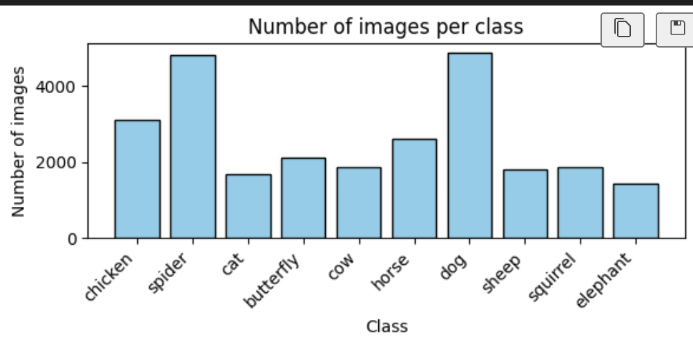
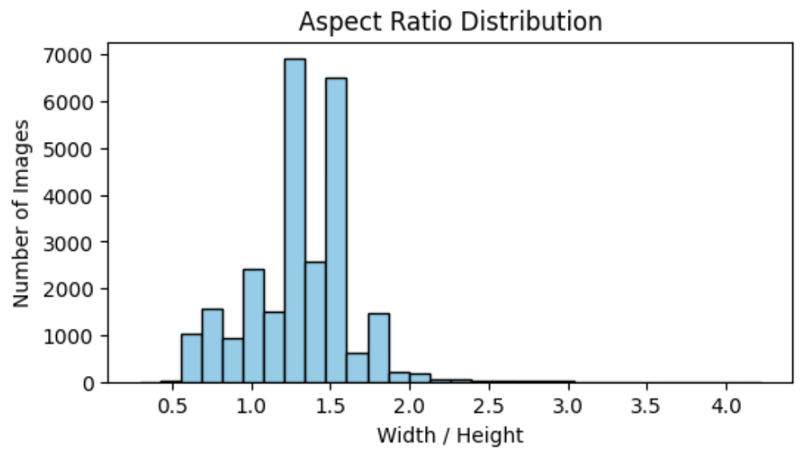
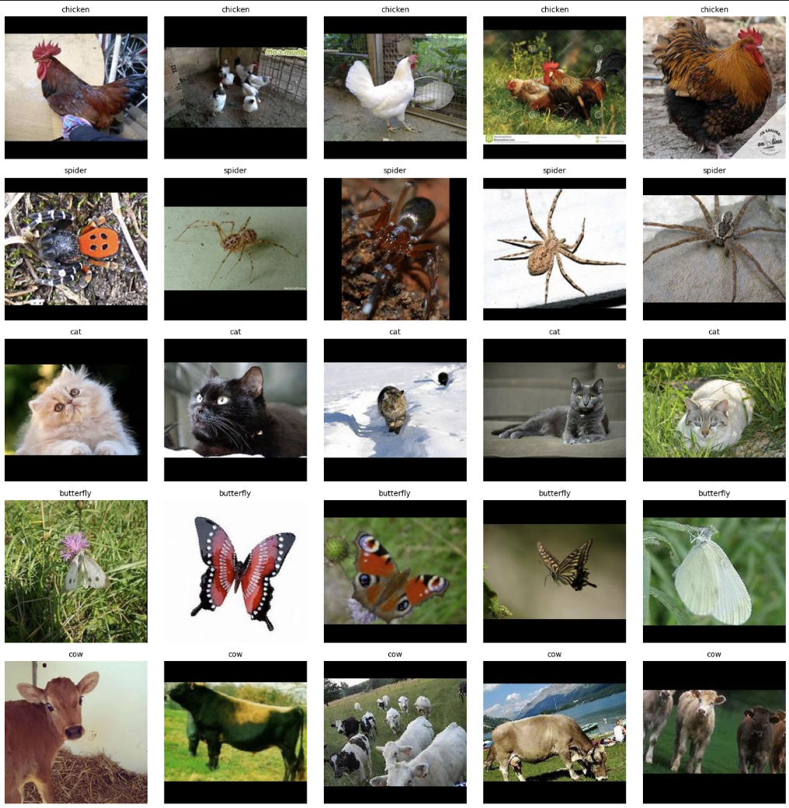
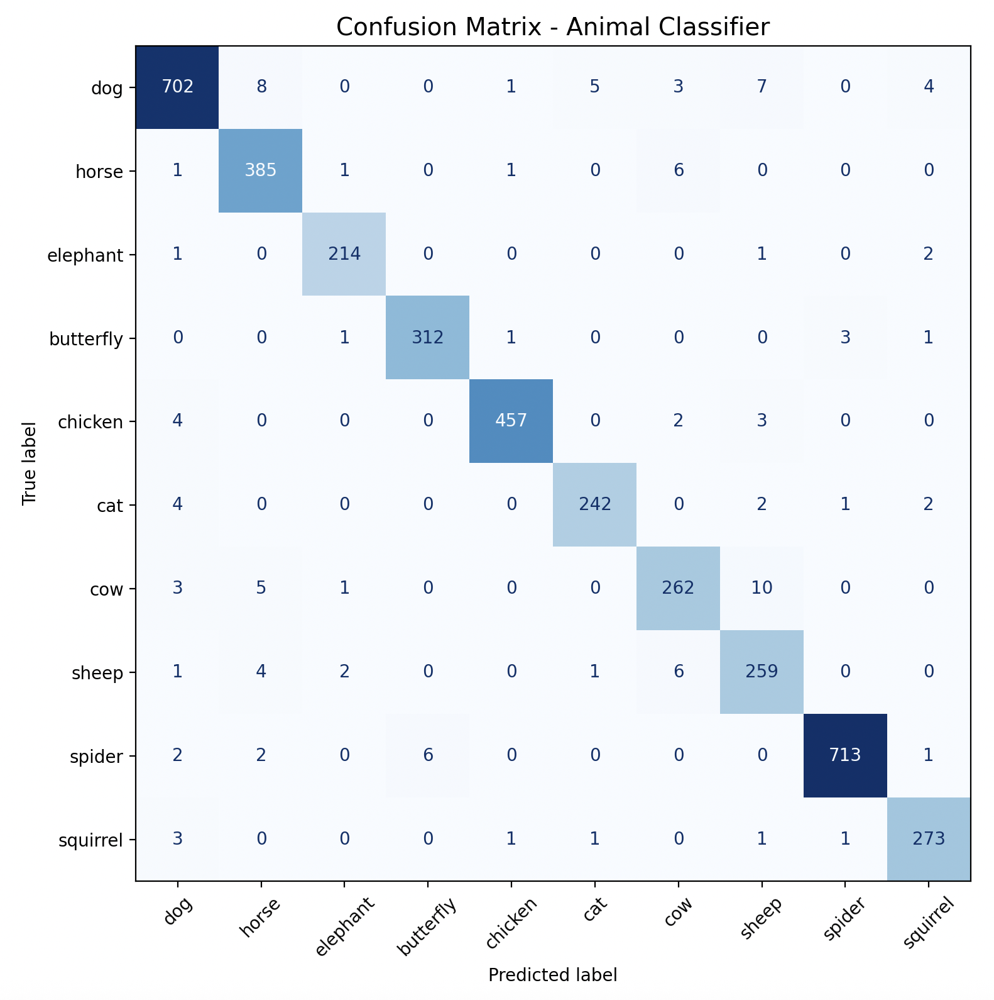

# Named Entity Recognition + Image Classification Pipeline

A comprehensive ML pipeline that combines NER (Named Entity Recognition) and image classification to verify user claims about animals in images.

## Table of content
- [Project Overview](#project-overview)
- [Installation and Setup](#installation-and-setup)
- [Project Structure](#project-structure)
- [Dataset](#dataset)
- [Model Development](#model-development)
  - [NER Model](#ner-model)
  - [Image Classification Model](#image-classification-model)
- [Pipeline](#pipeline)
- [Usage](#usage)
- [Results](#results)
- [General Summary](#general-summary)

## Project Overview

This project implements an ML pipeline that verifies user claims about animals in images by combining two models:

1. **NER Model** - Extracts animal names from text using a transformer-based model
2. **Image Classification Model** - Classifies animals in images (10 classes)
3. **Verification Pipeline** - Combines both models to return a boolean response

**Example workflow:**
- Input: Text: "There is a cow in the picture." + Image
- Pipeline extracts "cow" from text → Classifies image → Compares results → Returns True/False

**Example scenarios:**
| Text | Image | Output | Explanation |
| --- | --- | --- | --- |
| “There is a cat and a dog.” | cat | True | cat is mentioned and present in image |
| “There is a cat and a dog.” | dog | True | dog is mentioned and present |
| “There is a cat and a dog.” | cow | False | cow not mentioned |
| “No cats here, only dogs.” | cat | False | cat is negated |
| “No cats here, only dogs.” | dog | True | dog is not negated |

## Installation and Setup

### Prerequisites

- Python 3.9 or higher (developed and tested on Python 3.12)
- pip package manager


### Step 1: Clone the Repository

```bash
git clone <repository-url>
```

### Step 2: Create Virtual Environment (Recommended)

```bash
# On Windows
python -m venv venv
venv\Scripts\activate

# On macOS/Linux
python -m venv venv
source venv/bin/activate
```

### Step 3: Install Dependencies

```bash
pip install -r task2_ner_image_classification/requirements.txt
```

### Step 4: Environment Configuration

Copy `example_env` to `.env` and configure necessary variables:

```bash
cp task2_ner_image_classification/example_env task2_ner_image_classification/.env
```

### Required Packages

**Note**: Using the latest Keras 3.11 with a pre-trained EfficientNet can lead to unexpected errors, as described in [Cannot load weight... #21529](https://github.com/keras-team/keras/issues/21529) and [ValueError: Shape mismatch in layer #1... #99122](https://github.com/tensorflow/tensorflow/issues/99122) (Keras & TensorFlow issues). Downgrading to Keras 3.10.0 resolves the problem and is recommended.

```
kaggle==1.7.4.5
matplotlib==3.10.6
numpy==2.3.3
tensorflow==2.20.0
keras==3.10.0
spacy==3.8.7
spacy-transformers==1.3.9
```

## Project Structure

The project is organized as follows:

```
task2_ner_image_classification/
├── config/              # Configuration files
├── cv/                  # Computer Vision model implementation
├── data/                # Dataset storage
├── models/              # Trained model weights
├── ner/                 # NER model implementation
├── pipeline/            # Main pipeline logic
├── plots/               # Visualizations and analysis plots
├── schemas/             # Pydantic schemas for validation
├── utils/               # Utility functions
├── eda.ipynb            # Exploratory Data Analysis notebook
├── requirements.txt     # Python dependencies
└── Readme.md
```

Each folder contains modular components, making it easy to train, test, and extend both NER and CV models independently or together in the pipeline.


## Dataset

### Animal Classification Dataset

**Source:** [Animals-10 Kaggle Dataset](https://www.kaggle.com/datasets/alessiocorrado99/animals10/data)

**Description:** The Animals-10 dataset contains about 28K medium quality animal images belonging to 10 categories: dog, cat, horse, spyder, butterfly, chicken, sheep, cow, squirrel, elephant.

### Exploratory Data Analysis

EDA showed, that the dataset has a class imbalance, with some classes having moderately more images than others.



Also images have different widths and heights, and the aspect ratio varies as well, meaning that simple resizing could lead to distorted images.



So during preprocessing, all images were resized to a uniform target size while preserving their original aspect ratio. Padding was applied to avoid any distortion or stretching of the animals within the images. Additionally, to address class imbalance in the dataset, smaller classes were oversampled through data augmentation techniques such as rotation, flipping, and slight color adjustments. 

All preprocessing and augmentation steps were implemented in:
`task2_ner_image_classification/cv/utils/data_preprocessing.py`.

**Result Data**:


The resulting dataset after preprocessing and augmentation was too large to be uploaded to GitHub. To make the repository lightweight and easily runnable, a smaller **dummy dataset** was created instead. This reduced version includes `train_count=15`, `val_count=5`, and `test_count=5` images per class. The dummy dataset is already preprocessed, padded, and resized, allowing it to be used directly with all training and inference pipelines without additional preparation.

Can be found here: `task2_ner_image_classification/data/dummy_animals10`

### NER Training Data

The NER training dataset was created from scratch to match the 10 animal classes used in the image classification dataset: `cat`, `dog`, `cow`, `chicken`, `spider`, `butterfly`, `horse`, `sheep`, `squirrel`, and `elephant`. To make the model robust to variations in user input, the dataset includes synonyms and alternative terms for each class, such as `kitty` for `cat`, `puppy` for `dog`, `heifer` for `cow`, `hen` for `chicken`, `pony` for `horse`, `lamb` for `sheep`, `chipmunk` for `squirrel`, and `pachyderm` for `elephant`. Each sentence contains one or more mentions of these animals in different contexts to allow the pipeline to correctly interpret user statements.


## Model Development

### NER Model

**Architecture:** Transformer-based model built with spaCy’s `Transformer` component using **`google/mobilebert-uncased`** as the base architecture.  

**Training Details:**
- **Base model:** `google/mobilebert-uncased`
- **Training approach:** Fine-tuning the transformer-based NER head on a custom dataset of 10 animal classes and their synonyms (e.g., *cat/kitty*, *dog/puppy*, etc.)
- **Epochs:** 23 (with early stopping when loss plateaued)
- **Learning rate:** Default from spaCy’s transformer training configuration (`2e-5`)

**Usage:**

Example:
```bash
# Training
python -m task2_ner_image_classification.ner.train \
    --config "task2_ner_image_classification/config/ner_config.yaml"

# Inference
python -m task2_ner_image_classification.ner.inference \
    --config "task2_ner_image_classification/config/ner_config.yaml" \
    --text "There is a cow in the picture."
```

### Image Classification Model

**Architecture:** Transfer learning using a pre-trained EfficientNetB0.

**Training Details:**
- Model type: EfficientNetB0
- Input size: 224x224
- Epochs: 10
- Learning rate: 1e-4
- Batch size: 32
- Optimizer: Adam

**Performance:**
- Test Accuracy: 97%
- Precision: 96.6%
- Recall: 96.8%
- F1-Score: 96.7%

**Confusion Matrix:**



**Usage:**
```bash
# Training
python -m task2_ner_image_classification.cv.train \
    --config "task2_ner_image_classification/config/cv_config.yaml"

# Inference
python -m task2_ner_image_classification.cv.inference \
    --config "task2_ner_image_classification/config/cv_config.yaml" \
    --data "task2_ner_image_classification/data/test_pipeline/3.jpeg"
```

## Pipeline

The complete verification pipeline combines both models:

**Pipeline Flow:**
1. Receive text and image inputs
2. Extract animal entity from text using NER model
3. Classify the animal in the image
4. Compare extracted entity with predicted class
5. Return boolean result (True if they match, False otherwise)

**Usage:**
```bash
python pipeline_runner.py \
  --sentence "There is a dog but no cat here." \
  --image "task2_ner_image_classification/data/test_pipeline/1.png"
```

## General Summary

This project demonstrates a complete multimodal ML pipeline that integrates **Named Entity Recognition (NER)** and **Image Classification** to verify whether textual and visual inputs refer to the same animal entities. It supports inference through a unified pipeline that accepts both image and sentence inputs and produces a joint verification output.

**Key Achievements:**
- Successfully implemented a multi-model ML pipeline combining NER and CNN-based image classification.
- The **NER model** (fine-tuned MobileBERT) achieved stable entity recognition across 10 animal-related classes and common synonyms (e.g., *kitten*, *pony*, *heifer*), showing strong qualitative performance on unseen examples.
- The **image classification model** (EfficientNetB0) demonstrated robust accuracy and generalization.
- The **end-to-end pipeline** correctly matched entities between text and images in the majority of tested examples, confirming the feasibility of multimodal verification.

**Possible Improvements:**
- **NER Model:** Expand vocabulary coverage, include multi-word entities, and improve handling of ambiguous animal references.
- **Image Classification:** Further balance class representation with advanced augmentations and experiment with deeper backbones (e.g., EfficientNetV2 or ConvNeXt).
- **Pipeline:** Add confidence thresholding, support multiple detected entities per input, and include a fallback mechanism when model outputs are uncertain.
